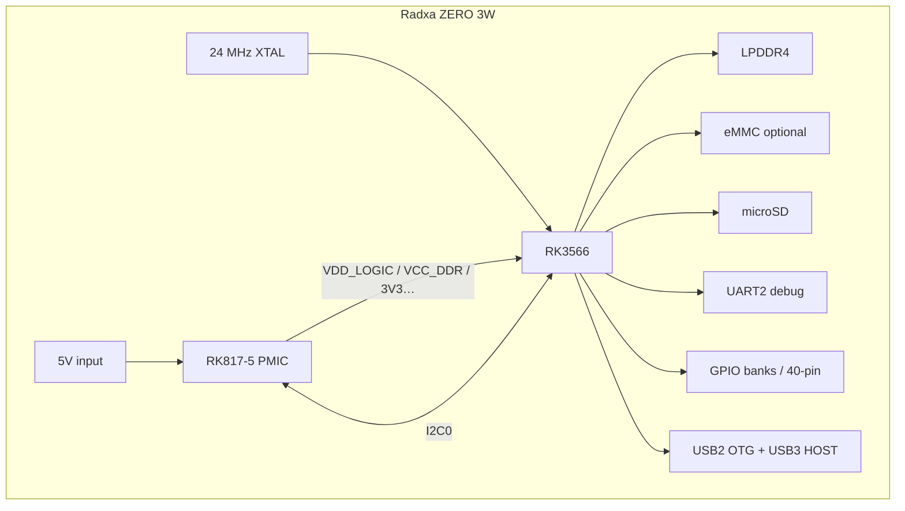

# Radxa ZERO 3W / RK3566 — hardware block diagram

Covers the Phase 2 exit checklist: **PMIC, clock tree, UART, GPIO, USB, DDR,
eMMC**. Sources: [`SOURCES.md`](SOURCES.md), notes in [`rk3566-notes.md`](rk3566-notes.md).

---

## 1. Board-level block diagram

```
                     ┌──────────────────────────────────────────┐
                     │           Radxa ZERO 3W                  │
   5V USB-C OTG ────▶│                                          │
                     │   ┌─────────────┐     I2C0               │
                     │   │  RK817-5    │◀───────────────┐       │
                     │   │ PMIC+Codec  │                │       │
                     │   └──────┬──────┘                │       │
                     │          │ rails: VDD_LOGIC,     │       │
                     │          │ VCC_DDR, 3V3, 1V8…    │       │
                     │          ▼                       │       │
                     │   ┌──────────────────────────────────┐   │
                     │   │         Rockchip RK3566          │   │
                     │   │  ┌────────┐  ┌─────┐  ┌───────┐  │   │
                     │   │  │ 4×A55  │  │ CRU │  │  PMU  │  │   │
                     │   │  │ CPU    │  │clk/ │  │(on-chip│  │   │
                     │   │  └────────┘  │rst  │  │ domains)│ │   │
                     │   │              └─────┘  └───────┘  │   │
                     │   │  ┌──────┐ ┌──────┐ ┌────┐ ┌────┐ │   │
                     │   │  │UART2 │ │GPIO  │ │USB │ │eMMC│ │   │
                     │   │  │debug │ │banks │ │PHY │ │host│ │   │
                     │   │  └──┬───┘ └──┬───┘ └─┬──┘ └─┬──┘ │   │
                     │   │     │        │       │      │    │   │
                     │   │  ┌──┴────────┴───────┴──────┴──┐ │   │
                     │   │  │     DDR controller 32-bit   │ │   │
                     │   │  └─────────────┬───────────────┘ │   │
                     │   └────────────────┼────────────────┘   │
                     │                    │                    │
                     │              LPDDR4 (1–8 GB)            │
                     │                    │                    │
                     │   microSD ◀──SDMMC──┤                   │
                     │   eMMC (optional) ──┘                   │
                     │                                          │
                     │   40-pin header: UART2 TX/RX, GPIO…     │
                     │   USB3 Type-C HOST                       │
                     └──────────────────────────────────────────┘
```

---

## 2. Clock tree (simplified)

```
                 Y1 24 MHz crystal
                    │
                    ▼
            RK3566 OSC (XIN24M/XOUT24M)          [S1 sheet 06][S6][S8]
                    │
                    ▼
                 PLLs inside SoC
                    │
        ┌───────────┴───────────┐
        ▼                       ▼
   PMUCRU @0xfdd00000      CRU @0xfdd20000     [S9]
        │                       │
        │                       ├── CPU clocks
        │                       ├── SCLK/PCLK UART2
        │                       ├── MMC / eMMC clocks
        │                       └── USB PHY clocks
        │
        └── low-power / PMU domain clocks

   Optional: RK817 32K out ──▶ PMIC_32KOUT_SOC     [S1 sheet 06]
```

---

## 3. PMIC power path (simplified)

```
  5V (USB-C OTG / GPIO 5V)     [S5]
           │
           ▼
      VCC_SYS domain
           │
           ▼
      RK817-5 PMIC             [S1 sheet 21]
           │
           ├── BUCK → VDD_LOGIC  → SoC logic domain
           ├── BUCK → VCC_DDR    → LPDDR4
           ├── → VCC3V3_SYS      → IO / peripherals
           └── → 1.8V / 0.9V PMU analog rails
```

---

## 4. Data-path focus (UART / GPIO / USB / DDR / eMMC)

```
  USB-TTL adapter                 LPDDR4
       │                            ▲
       │ 1500000 8N1 [S4]           │ 32-bit
       ▼                            │
  Header pins 8/10 (UART2_M0)       │
       │                            │
       ▼                            │
  UART2 @0xfe660000 ───────────── CPU / bus fabric ── DDR ctrl
       ▲                            │
       │ pinmux                     ├── eMMC @0xfe310000 ──▶ onboard eMMC
  GPIO0 @0xfdd60000                 ├── SDMMC ─────────────▶ microSD
                                    └── USB2 PHY ──────────▶ Type-C OTG/HOST
```

---

## 5. Mermaid (same content, renderable)



---

## 6. Acceptance checklist (Phase 2 diagram)

| Required block | Present? | Where above | Primary cite |
|---|---|---|---|
| PMIC | Yes | §§1, 3 | [S1] sheet 21 |
| Clock tree | Yes | §2 | [S1][S6][S8][S9] |
| UART | Yes | §§1, 4 | [S3][S4][S9] |
| GPIO | Yes | §§1, 4 | [S3][S9] |
| USB | Yes | §§1, 4 | [S1][S2][S6] |
| DDR | Yes | §§1, 4 | [S1][S2][S6] |
| eMMC | Yes | §§1, 4 | [S1][S2][S6] |
